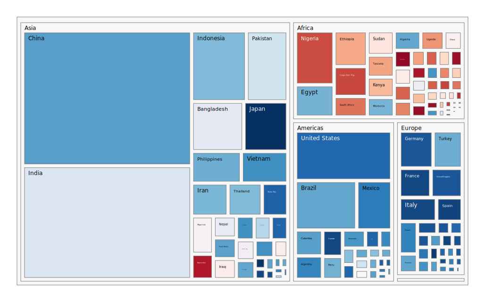

Pretty Treemaps

```
$ go install github.com/nikolaydubina/treemap/cmd/treemap@latest 
$ echo '
Africa/Algeria,33333216,72
Africa/Angola,12420476,42
Africa/Benin,8078314,56
' | treemap > out.svg
```

World population and life expectancy


## Format

Size is required. Heat is optional. For more customizations  

```
</ delimitered path>,<size>,<heat>
```

## Algorithms

* `Squarified` algorithm for treemap layout problem. This is very common algorithm used in Plotly and most of visualization packages. _"Squarified Treemaps", Mark Bruls, Kees Huizing, and Jarke J. van Wijk, 2000_

## Contributions

Welcomed!

## References

* Plotly treemaps: https://plotly.com/python/treemaps/
* go-colorful: https://github.com/lucasb-eyer/go-colorful
* D3 treemap is using Squerified: https://github.com/d3/d3-hierarchy
* Interactive treemap: https://github.com/vasturiano/treemap-chart
* Squerified in Rust: https://github.com/bacongobbler/treemap-rs
* Squerified in JavaScript: https://github.com/clementbat/treemap
* Squerified in Python: https://github.com/laserson/squarify
* Treemap Go tool: https://github.com/willpoint/treemap
